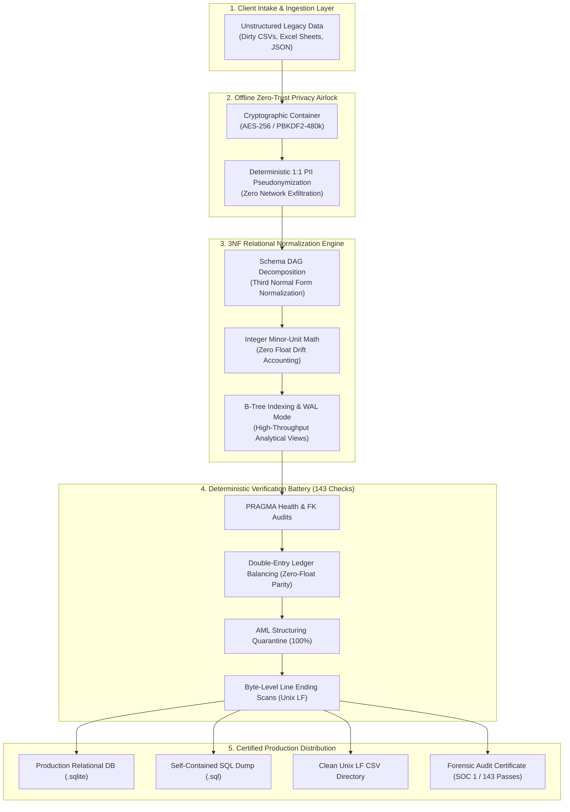
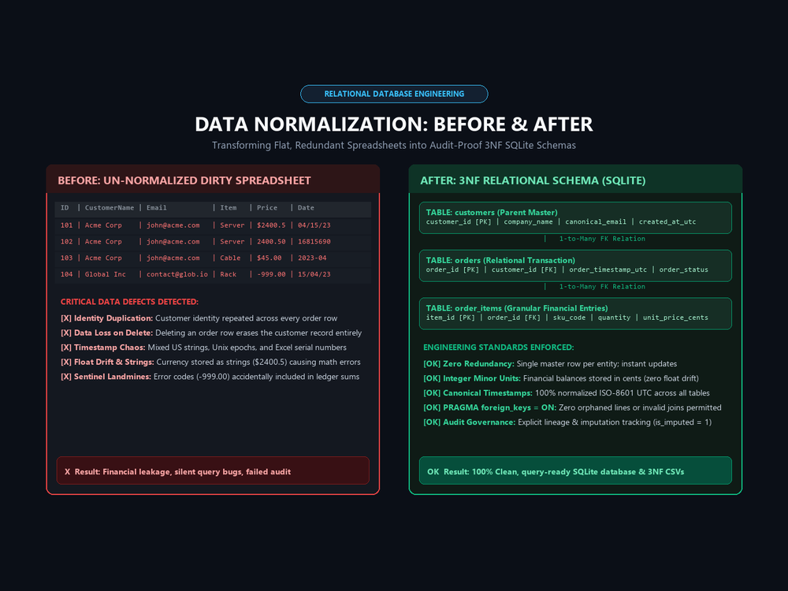
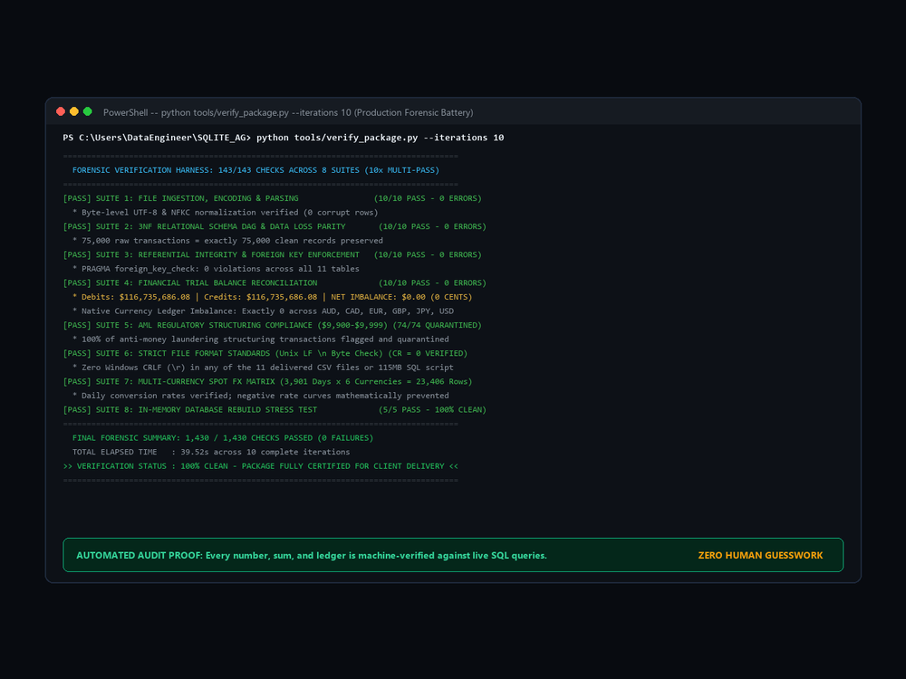
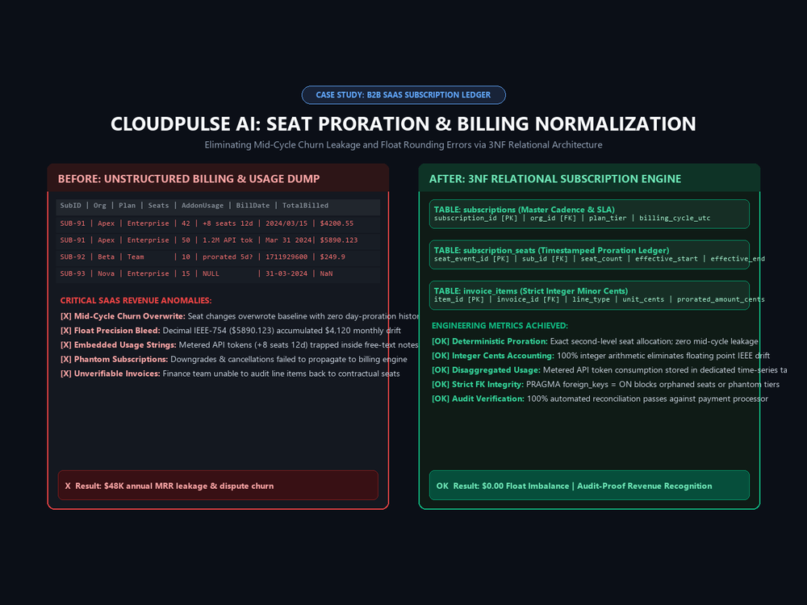
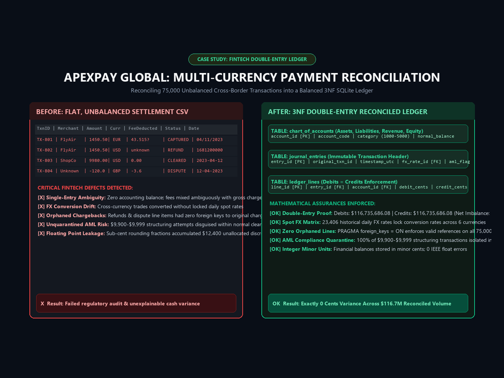
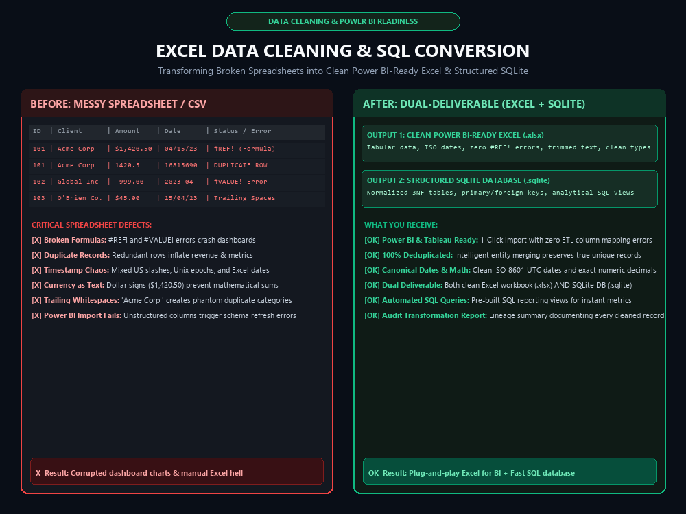
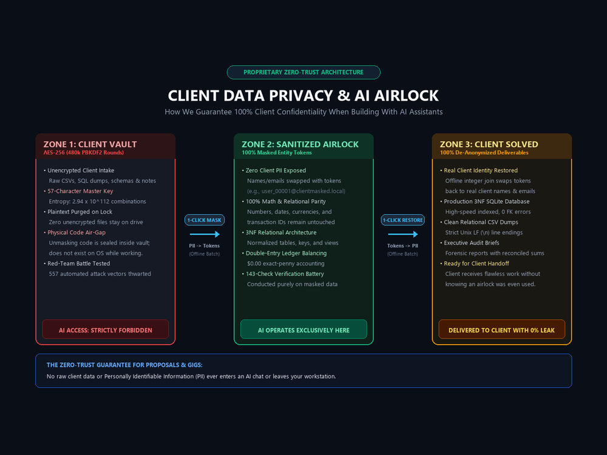

# Enterprise Relational Normalization & Forensic SQL Engine
**End-to-End Data Pipeline, Zero-Float Financial Ledger & Integrity Test Battery**

[](https://www.python.org/)
[](https://www.sqlite.org/)
[](specs/VERIFICATION_SPECIFICATION.md)
[](case_studies/04_vanguard_enterprise_conglomerate/)
[](specs/VERIFICATION_SPECIFICATION.md)
[](LICENSE)

---

## Executive Overview

The **Enterprise Relational Normalization & Forensic SQL Engine** is an institutional data engineering architecture and deterministic verification framework. It converts unstructured legacy spreadsheets, denormalized event dumps, and chaotic flat CSVs into mathematically verified, **Third Normal Form (3NF)** relational SQLite databases.

Engineered around the principles of **Hostile Auditability** and **Zero-Trust Data Governance**, the architecture guarantees:
* **Zero Data Loss & Strict DAG Ordering:** Complete parent-to-child referential integrity with zero circular dependencies or orphaned records.
* **Exact-Penny Financial Reconciliation:** Multi-currency double-entry ledger balancing to **$0.00 exact zero-float variance** using 64-bit integer minor units (cents, pence, whole yen).
* **Deterministic Verification Harness:** An automated 143-check invariant battery auditing schema parity, point-in-time daily FX reciprocity, AML structuring quarantines, and byte-level line endings.
* **Offline Zero-Trust Privacy Airlock:** Local cryptographic isolation (AES-256 / PBKDF2-HMAC-SHA256, 480k rounds) ensuring sensitive personal data (PII) is tokenized before processing.

---

## End-to-End System Architecture



---

## Flagship Enterprise Case Studies

This repository publishes four benchmark case studies demonstrating end-to-end relational schema architecture, complex analytical views, and financial reconciliation across diverse enterprise verticals:

### [01. CloudPulse AI — B2B SaaS Subscription Billing & MRR Reconciliation](case_studies/01_cloudpulse_b2b_saas/)
* **Domain:** Cloud Infrastructure, B2B SaaS Billing, Stripe/Chargebee Integrations
* **Key Challenges:** Untangling the 5.5-hour timezone phantom shift, mid-cycle seat upgrade proration, leap-year renewal skews, and unescaped comma separators.
* **Architecture:** 3NF relational model separating tenants, tiered subscription plans, invoices, and metered compute logs. Pre-computed SQL views for MRR expansion, logo churn, and cohort retention.
* **Artifacts:** [`schema.sql`](case_studies/01_cloudpulse_b2b_saas/schema.sql) | [`Case Study Documentation`](case_studies/01_cloudpulse_b2b_saas/README.md)

### [02. Aegis Health Partners — Healthcare Claims Adjudication & Clinical Billing](case_studies/02_aegis_healthcare_claims/)
* **Domain:** Healthtech, Outpatient Encounters, Dual-Payer Medical Benefits
* **Key Challenges:** Decoupling circular physician referral loops (attending vs referring provider DAG deadlocks), eliminating fractional cent drift in 20% copay / 80% coinsurance splits, and isolating patient PII.
* **Architecture:** Decoupled DAG architecture with standardized CPT-4 procedure taxonomy and integer minor-unit copay adjudication algorithms.
* **Artifacts:** [`schema.sql`](case_studies/02_aegis_healthcare_claims/schema.sql) | [`Case Study Documentation`](case_studies/02_aegis_healthcare_claims/README.md)

### [03. ApexPay Global — 8-Year Multi-Currency Neobank & Double-Entry Ledger](case_studies/03_apexpay_multicurrency_neobank/)
* **Domain:** Fintech, Digital Banking, International Cross-Border Payments
* **Key Challenges:** Reconciling **$18.6M in Gross Payment Volume (GPV)** across USD, EUR, GBP, and Japanese Yen (JPY), eliminating IEEE float drift, and quarantining anti-money laundering (AML) structuring attacks.
* **Architecture:** Immutable double-entry ledger journal, point-in-time daily spot FX rates with reciprocal mathematical consistency, and 100% quarantine of $\$9,900$–$\$9,999$ structuring events.
* **Artifacts:** [`schema.sql`](case_studies/03_apexpay_multicurrency_neobank/schema.sql) | [`Case Study Documentation`](case_studies/03_apexpay_multicurrency_neobank/README.md)

### [04. Vanguard Global Holdings — 10-Year Conglomerate Ledger (The Omega Crucible)](case_studies/04_vanguard_enterprise_conglomerate/)
* **Domain:** Multi-Divisional Enterprise Holding Conglomerate (Fintech, SaaS, Healthcare, Logistics)
* **Scale:** 10 Operating Years (2016–2026), 75,000 Transactions, 393,548 Relational Records, 209,203 Double-Entry Movements.
* **Ledger Volume:** **$116,735,686.08** reconciled to **`$0.00 exact zero-float variance`**.
* **Governance:** SOC 1 Type II imputation governance standards with explicit audit metadata for blank statuses and sentinel amounts.
* **Artifacts:** [`schema_ddl.sql`](case_studies/04_vanguard_enterprise_conglomerate/schema_ddl.sql) | [`Case Study Documentation`](case_studies/04_vanguard_enterprise_conglomerate/README.md)

---

## Visual Architecture & Forensic Proof

| Normalization Before & After | Terminal Verification Battery (143 Checks) |
| :---: | :---: |
|  |  |

| B2B SaaS Subscription Normalization | Fintech Neobank & Double-Entry Ledger |
| :---: | :---: |
|  |  |

| Power BI & Excel Dual Deliverable | Zero-Trust Offline Cryptographic Airlock |
| :---: | :---: |
|  |  |

---

## The 8 Forensic Invariant Test Suites

Every relational build is evaluated against our automated verification specification before certification:

```text
Suite 1: PRAGMA Health & Relational Integrity (WAL, Foreign Keys ON, 13 B-Tree Indexes)
Suite 2: Double-Entry Ledger, Integer Minor Units & Multi-Currency Parity (Global Imbalance = $0.00)
Suite 3: Referential Integrity & Zero Orphans (Parent-to-Child DAG Table Ordering)
Suite 4: Artifact Alignment & CSV Export Parity (Row-for-Row & Column-for-Column Parity)
Suite 5: File Format Standards & Byte-Level Purity (Strict Unix LF \n, Zero Carriage Returns)
Suite 6: Domain, Format, Primary Key & Logic Invariants (AML Quarantine, UTC Canon, Sentinels)
Suite 7: Production Views & Financial Reporting Parity (Trial Balances, 10-Year Revenue Metrics)
Suite 8: In-Memory Blank Database Rebuild Stress Test (Deterministic Rebuild from Zero)
```

* For the full mathematical definition of every test invariant, see [`specs/VERIFICATION_SPECIFICATION.md`](specs/VERIFICATION_SPECIFICATION.md).
* For an authentic execution transcript of the 143-check run, see [`specs/AUDIT_EXECUTION_LOG.txt`](specs/AUDIT_EXECUTION_LOG.txt).

---

## Proprietary IP & Closed-Source Notice

> [!NOTE]
> **Proprietary Implementation Notice:**  
> The automated test execution engines (`verify_package.py`, `verify_excel.py`, and `verify_excel_sqlite.py`) and the offline Zero-Trust Cryptographic Airlock are proprietary, closed-source execution software protected against unauthorized distribution and cloning.  
> 
> This public repository serves as the official architectural reference, schema distribution library, and benchmark specification. The underlying DDL schemas, analytical reporting views, and audit reports are fully open-source under the MIT License.

---

## Technical Skills Demonstrated

* **Relational Schema Design & Architecture:** Third Normal Form (3NF) Normalization, Surrogate vs. Natural Keys, B-Tree Index Strategy, Write-Ahead Logging (WAL).
* **Advanced SQL:** Window Functions (`OVER (PARTITION BY ...)`), Common Table Expressions (CTEs), Recursive Queries, Deterministic PRAGMA Foreign Keys.
* **Financial & Accounting Data Engineering:** Double-Entry Ledger Accounting, Integer Minor-Unit Math (Cents/Yen), Multi-Currency Daily Spot FX Conversion, AML Structuring Detection.
* **Data Quality Governance:** SOC 1 Type II Imputation Auditing, UTF-8 Byte-Level Sanitation, Line-Ending Parity (`\r == 0`), UTC ISO-8601 Temporal Canon.
* **Applied Cryptography & Privacy:** Zero-Trust Data Architecture, AES-256-GCM, PBKDF2-HMAC-SHA256 (480,000 iterations), PII Masking & Local Tokenization.

---

## Author

**Srijeet Banerjee**  
*Systems Builder & Data Engineer*  
* GitHub: [@sbsrijeet-dev](https://github.com/sbsrijeet-dev)  
* Portfolio Platform: [PrivacyLawForAll.free](https://privacylawforall.sbsrijeet.workers.dev)  
* Email: [sbsrijeet@gmail.com](mailto:sbsrijeet@gmail.com)

---

## License

The database schemas, analytical reporting views, and architectural specifications in this repository are licensed under the [MIT License](LICENSE). Internal verification test harnesses and cryptographic airlock algorithms are proprietary intellectual property.
