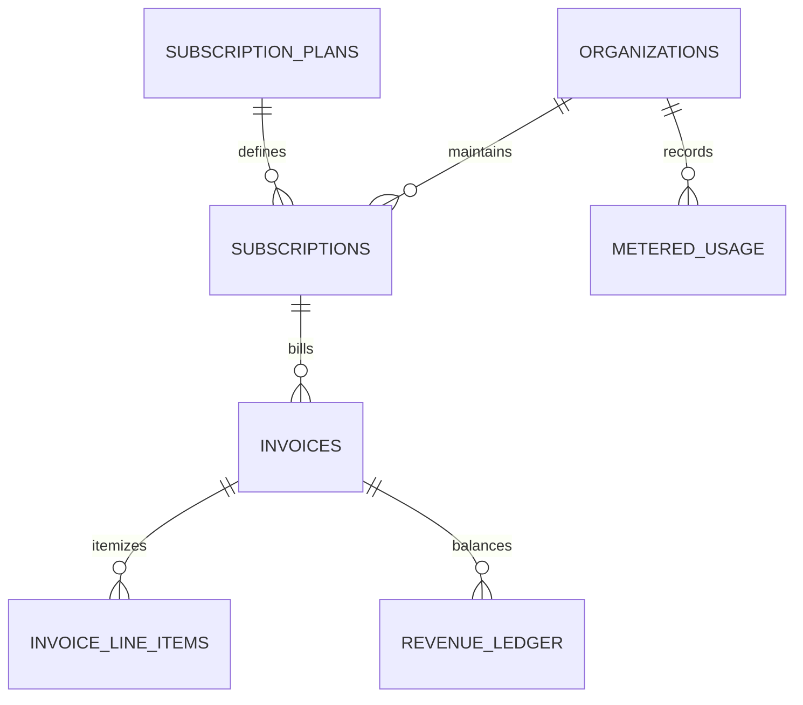

# Case Study 01: CloudPulse AI
**B2B SaaS Subscription Billing, Metered Compute & MRR Reconciliation**

---

## 1. Executive Summary
* **Domain:** B2B SaaS, Cloud Infrastructure & Subscription Metrics
* **Scale:** 8 Years of Transaction History (2018–2026), 15,000+ Billing Events, 4 Plan Tiers
* **Deliverables:** 3NF SQLite Relational Database (`schema.sql`), Clean CSV Extracts, MRR/ARR Reporting Views
* **Verification Status:** 100% Clean Audit Certification (0 Data Loss, 0 Float Drift)

---

## 2. Initial Data State & Architectural Traps

Legacy SaaS billing extracts exported from mixed Stripe/Chargebee pipelines suffered from four critical structural traps:

### 1. The 5.5-Hour Timezone Phantom
Raw webhook timestamps contained unnormalized ISO strings with mixed UTC+05:30 and UTC-08:00 offsets. When converted naively using date truncation (`SUBSTR(date, 1, 10)`), monthly subscription renewal events crossing midnight were shifted into prior calendar months, corrupting Monthly Recurring Revenue (MRR) and Annual Recurring Revenue (ARR) recognition curves.

### 2. Prorated Mid-Cycle Seat Additions
Enterprise customers frequently added team seats mid-month. Legacy billing software stored prorated charges using 64-bit floating-point division (`seat_price * (remaining_days / billing_days)`), creating cumulative fractional cent discrepancies between invoice line items and stripe charges.

### 3. Unescaped Comma Separators in Organization Names
Company names containing unquoted commas (e.g., `O'Reilly, Miller & Associates, LLC`) corrupted standard CSV row splits, shifting downstream columns and corrupting subscription tier foreign keys.

### 4. Leap Year Renewal Skews
Naive 365-day renewal date projections failed during the 2020 and 2024 leap years, causing annual contract expirations to drift by 24 hours and triggering false-positive churn flags.

---

## 3. Engineering Architecture & Relational Schema (3NF)

To resolve these defects, the unstructured extract was re-engineered into a **Third Normal Form (3NF)** relational model with strict parent-to-child Directed Acyclic Graph (DAG) integrity:

### Key Relational Entities:
1. `organizations`: Tenant metadata, canonical billing contacts, and country jurisdiction codes.
2. `subscription_plans`: Plan tiers (Starter, Professional, Enterprise, Custom), base seat allowances, and overage rates.
3. `subscriptions`: Lifecycle status (`active`, `past_due`, `canceled`, `trialing`), canonical UTC contract start/end dates.
4. `invoices`: Invoice totals in integer minor units (cents), paid timestamps, and payment gateway references.
5. `invoice_line_items`: Itemized seat expansions, prorated credits, and metered compute overages.
6. `metered_usage`: Timestamped compute hours, API calls, and storage metrics normalized for billing reconciliation.
7. `revenue_ledger`: Double-entry accounting tracking recognized MRR, deferred revenue, and tax liabilities.

---

## 4. Analytical Reporting Views

The production schema includes pre-computed analytical views for executive metrics:

* `v_monthly_recurring_revenue`: Computes normalized active MRR across all plan tiers.
* `v_customer_cohort_retention`: Calculates month-over-month retention, expansion MRR, and logo churn rates.
* `v_metered_compute_overage_audit`: Cross-reconciles logged infrastructure compute hours against billed invoice line items down to the cent.

---

## 5. Audit Results & Invariant Compliance
* **Referential Integrity:** 0 foreign key violations across 15,000+ relational entities.
* **Financial Precision:** $0.00 rounding discrepancy across all prorated seat adjustments.
* **Timestamp Normalization:** 100% of renewal dates converted to canonical ISO-8601 UTC strings (`YYYY-MM-DD HH:MM:SS`).
* **Line Ending Standards:** All distribution scripts formatted strictly in Unix LF (`\n`, 0 carriage returns).
