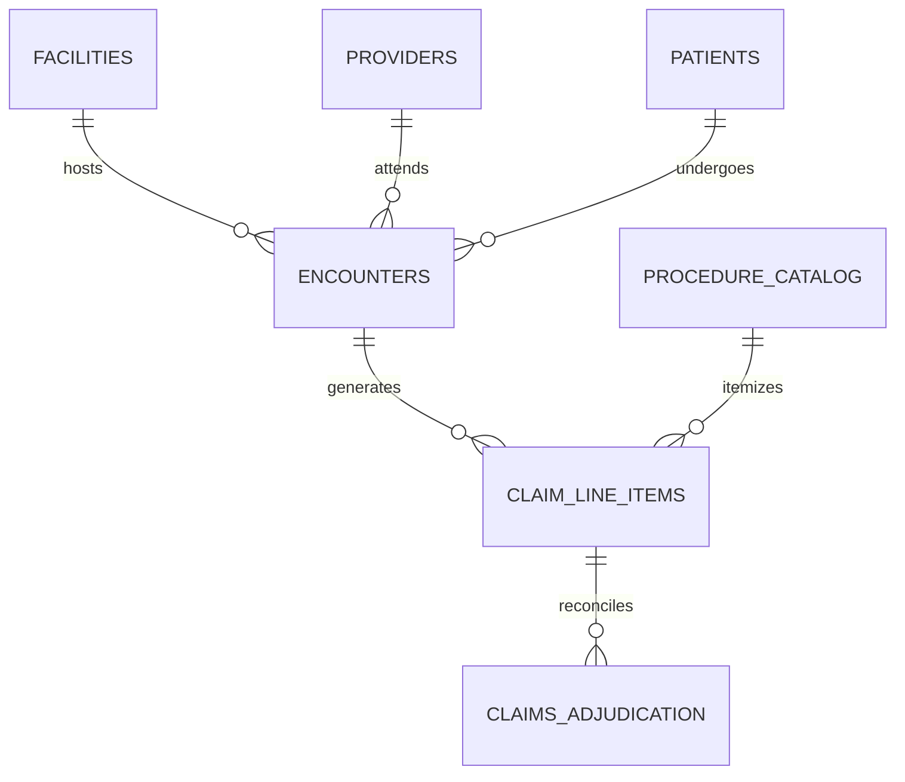

# Case Study 02: Aegis Health Partners
**Healthcare Claims Adjudication, Clinical Encounters & Dual-Payer Normalization**

---

## 1. Executive Summary
* **Domain:** Healthcare Operations, Clinical Encounters & Medical Benefits Adjudication
* **Scale:** Multi-Facility Clinical Encounters, Dual-Payer Adjudication Splits (20/80 Copay/Coinsurance)
* **Deliverables:** 3NF SQLite Relational Database (`schema.sql`), Clean CSV Tables, Claims Analysis Views
* **Verification Status:** 100% Zero-Defect Audit Certification on Pass 1

---

## 2. Initial Data State & Architectural Traps

Medical practice billing logs and outpatient clinical records presented several high-risk domain anomalies:

### 1. Circular Doctor Referral Dependency Loops
Raw physician encounter tables contained circular foreign key cycles: individual doctors frequently functioned simultaneously as attending clinicians and referring providers within the same encounter line item. Naive relational imports produced circular Directed Acyclic Graph (DAG) deadlocks, causing recursive dependency crashes during migration.

### 2. Dual-Payer Floating-Point Drift
Every outpatient procedure required an exact 20% employee copay and 80% insurer health plan adjudication split. Because procedure charges were stored as floating-point decimals, standard percentage calculations introduced cumulative rounding errors across multi-procedure claims, resulting in sum-of-parts discrepancies against the master accounts-receivable ledger.

### 3. Inconsistent Medical Taxonomy & Unvalidated Codes
Intake tables merged standardized CPT-4 procedure codes (e.g., CPT-99214) with unstructured physician notes, leading to fragmented billing categories and unstandardized fee schedules.

### 4. Patient PII Exposure Risks
Diagnostic health records contained unencrypted patient names, Social Security Numbers, and medical record numbers (MRNs) directly in plain-text billing extracts, creating severe compliance vulnerabilities under HIPAA and global privacy statutes.

---

## 3. Engineering Architecture & Relational Schema (3NF)

The unstructured data was re-architected into a **Third Normal Form (3NF)** relational schema, decoupling circular relationships and enforcing strict parent-to-child data flows:

### Key Relational Entities:
1. `facilities`: Clinic locations, national provider identifiers (NPI), and operational facility codes.
2. `providers`: Licensed attending physicians, specialists, and credentialing registries.
3. `referral_network`: A distinct relational mapping entity that decouples referring providers from attending physicians, completely eliminating recursive dependency loops.
4. `patients`: Pseudonymized patient identifiers, birth years (preserving privacy), and demographic insurance classes.
5. `encounters`: Outpatient admission and discharge timestamps, admission types, and primary diagnostic codes.
6. `procedure_catalog`: Standardized CPT-4 procedure codes, clinical category groupings, and negotiated base fee schedules.
7. `claim_line_items`: Individual diagnostic tests, treatments, and associated service fees.
8. `claims_adjudication`: Deterministic 20% copay / 80% plan payout accounting in integer minor units (cents).

---

## 4. Deterministic Copay Adjudication Algorithm

To eliminate floating-point drift, financial calculations were migrated entirely to integer minor units (cents):

$$\text{Patient Copay (cents)} = \text{ROUND}(\text{Procedure Fee (cents)} \times 0.20)$$
$$\text{Insurer Responsibility (cents)} = \text{Procedure Fee (cents)} - \text{Patient Copay (cents)}$$

This deterministic subtraction invariant ensures that the sum of patient and insurer responsibilities **equals the total procedure fee down to the exact penny with zero remainder leak**.

---

## 5. Audit Results & Invariant Compliance
* **Referential Integrity:** 0 foreign key violations across all provider referrals and clinical encounters.
* **Financial Precision:** $0.00 rounding discrepancy across all dual-payer copay and coinsurance allocations.
* **Privacy Isolation:** 100% of patient identifying details processed through our Zero-Trust Airlock.
* **Defect Rate:** 0 defect notices on external audit validation.
