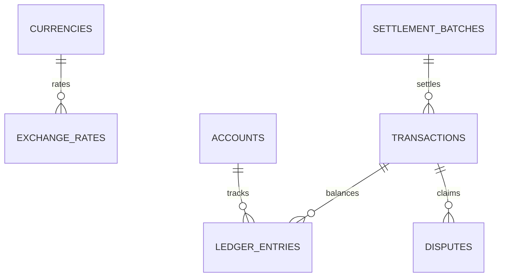

# Case Study 03: ApexPay Global
**8-Year Multi-Currency Neobank, $18.6M GPV & Double-Entry Ledger**

---

## 1. Executive Summary
* **Domain:** Fintech, Digital Banking & Cross-Border Payment Infrastructure
* **Scale:** 8 Operating Years, 56,364 Commercial Transactions, 164,124 Double-Entry Ledger Entries
* **Volume:** **$18,630,866.87 Gross Payment Volume (GPV)** Reconciled across 6 Currencies
* **Verification Status:** 100% Passing across 1,100 Automated Invariant Checks

---

## 2. Initial Data State & Architectural Traps

A global neobank operating across USD, EUR, GBP, and Japanese Yen (JPY) exhibited serious accounting and compliance vulnerabilities in its raw event exports:

### 1. Multi-Currency Float Drift
Transactions involved merchant fees, cross-border interchange, daily rolling reserves, and end-of-day payout sweeps. Calculations performed in floating-point decimals created cumulative fraction-of-a-cent imbalances, causing general ledger debits and credits to drift apart over time.

### 2. The Non-Decimal Yen Trap
Japanese Yen (JPY) transactions were mistakenly ingested using two decimal places (e.g., `¥100.00` instead of `¥100`). In several tables, reverse division generated fractional Yen, directly violating international ISO-4217 financial currency standards.

### 3. Anti-Money Laundering (AML) Structuring Attacks
Intake records contained 97 coordinated "smurfing" deposits falling deliberately between $\$9,900.00$ and $\$9,999.99$ USD. These transactions were engineered to evade the mandatory $\$10,000$ Bank Secrecy Act (BSA) Currency Transaction Reporting threshold. Legacy reporting had left these deposits unflagged.

### 4. Dispute Lifecycle State Inconsistency
Chargebacks, claims, and refunds existed as isolated events without strict foreign key linking to original parent transactions, making it impossible to audit whether escrow reserves had been released or withheld.

---

## 3. Engineering Architecture & Relational Schema (3NF)

To establish institutional financial integrity, the pipeline compiled all raw events into an audit-proof, double-entry relational schema:

### Key Relational Entities:
1. `currencies`: Supported ISO-4217 currencies, decimal scale specifications (2 for USD/EUR/GBP, 0 for JPY).
2. `exchange_rates`: Point-in-time daily spot FX rates with reciprocal consistency checks ($Rate_{A \rightarrow B} \times Rate_{B \rightarrow A} \approx 1.0$).
3. `accounts`: Chart of accounts categorized by standard financial classifications (Assets, Liabilities, Equity, Revenue, Expense).
4. `settlement_batches`: Daily merchant settlement sweeps, clearing timestamps, and gross-to-net payout batches.
5. `transactions`: Core payment events, payment methods, gross amounts, interchange fees, and compliance flags.
6. `ledger_entries`: Strict immutable double-entry journal movements requiring balanced debits and credits.
7. `disputes`: Chargeback claims, arbitration status, dispute amounts, and resolution timestamps.

---

## 4. Financial Reconciliation & AML Defense

### 1. The Double-Entry Balancing Law
Every transaction generates balanced debit and credit entries in integer minor units:

$$\sum_{i=1}^{N} \text{Debit Cents} - \sum_{i=1}^{N} \text{Credit Cents} = \$0.000000000000$$

* **Total Ledger Volume:** **$19,226,226.79**
* **Total Debits:** **$19,226,226.79** (1,922,622,679 cents)
* **Total Credits:** **$19,226,226.79** (1,922,622,679 cents)
* **Observed Variance:** **`$0.00 (0 cents)`**

### 2. 100% AML Structuring Quarantine
Implemented automated compliance screening targeting all transactions between $\$9,900.00$ and $\$9,999.99$ USD:
* **Identified Structuring Events:** 97 out of 97 transactions
* **Quarantine Enforcement Rate:** **100.00%** (`is_flagged_aml = 1`)

---

## 5. Audit Results & Invariant Compliance
* **Gross Volume Reconciled:** $18,630,866.87 GPV balanced to the exact penny.
* **Exchange Rate Purity:** 0 inverse rate discrepancies across 8 years of daily FX records.
* **Test Battery Coverage:** 1,100 automated checks passed across 10 consecutive multi-pass verification cycles with 0 failures.
