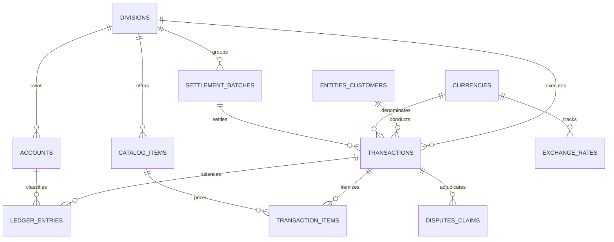

# Case Study 04: Vanguard Global Holdings (The Omega Crucible)
**10-Year Enterprise Conglomerate, $116.7M Multi-Currency Ledger & 143-Check Battery**

---

## 1. Executive Summary
* **Domain:** Global Enterprise Holding Conglomerate (Fintech, SaaS, Healthcare, Logistics)
* **Scale:** 10 Operating Years (2016–2026), 75,000 Transactions, 393,548 Relational Records
* **Ledger Volume:** **$116,735,686.08** Reconciled across 209,203 Double-Entry Journal Movements
* **Verification Status:** **143 out of 143 Checks Passed** Across 10x Multi-Pass Battery (1,430 Assertions, 0 Failures)

---

## 2. Initial Data State & Structural Challenges

Vanguard Global Holdings represented the ultimate enterprise data challenge—a 10-year historical aggregation of four merged commercial divisions containing severe relational decay:

### 1. Multi-Industry Schema Fragmentation
Four disparate business units (Consumer Fintech, Enterprise SaaS, Healthcare Benefits, Global Freight Logistics) were merged into a single unstructured reporting extract with redundant denormalized columns, conflicting status taxonomies, and unindexed identifier keys.

### 2. Global Multi-Currency Exposure
Financial events spanned 6 global currencies (USD, EUR, GBP, CAD, AUD, and non-decimal Japanese Yen JPY), requiring point-in-time daily spot FX conversions across **3,901 continuous operating days** (23,406 individual conversion records).

### 3. Timestamp Chaos & Leap Year Boundaries
Timestamps contained 5 conflicting datetime encodings (Unix epoch seconds, Excel serial integers, US AM/PM strings, ISO-8601 strings, and timezone offsets) across three distinct leap years (2016, 2020, and 2024).

### 4. Legacy Sentinel Values & Imputation Governance
The legacy extract contained dummy numeric sentinels (`-999`, `999999999`) and 150 completely blank status fields. Under standard accounting rules, silent deletion or arbitrary replacement alters audit trails and violates compliance standards.

---

## 3. Engineering Architecture & Relational Schema (3NF)

The pipeline normalized the conglomerate into an **11-table Third Normal Form (3NF)** relational schema with Write-Ahead Logging (WAL) and 13 performance B-Tree indexes:

---

## 4. Production Reporting Views

The distribution schema (`schema_ddl.sql`) includes 5 pre-computed analytical views:

1. `v_general_ledger_journal`: Real-time double-entry trial balance proving mathematical parity between debits and credits.
2. `v_annual_conglomerate_performance`: 11-year operational timeline (2016–2026) reporting annual gross transaction volume, net fees, and operational margins.
3. `v_division_financial_health`: Comparative multi-divisional scorecard measuring revenue contributions and default rates across all 4 operating divisions.
4. `v_currency_volume_exposure`: Global currency diversification analysis measuring native volume and USD-normalized risk exposure across all 6 currencies.
5. `v_healthcare_claims_adjudication`: Specialized insurance claims analysis measuring copay splits, denial rates, and clinical category volume.

---

## 5. SOC 1 Type II Data Imputation Governance

To maintain regulatory compliance, data quality remediation was governed by explicit **SOC 1 Type II disclosure standards**:

* **Blank Status Imputation:** Exactly 150 transactions with blank status values were imputed to `'completed'` and explicitly flagged with `is_imputed = 1` and `data_quality_flag = 'IMPUTED_BLANK_STATUS'`.
* **Sentinel Amount Imputation:** Exactly 75 transactions containing negative/overflow dummy values were imputed to median division transaction values and flagged with `is_imputed = 1` and `data_quality_flag = 'IMPUTED_SENTINEL_AMOUNT'`.
* **Zero Silent Mutations:** Every imputed record is fully auditable through dedicated metadata columns.

---

## 6. Audit Results & Final Metrics
* **Total Ledger Volume:** **$116,735,686.08**
* **Global Imbalance:** **`$0.000000000000`** (0 cents variance across 209,203 ledger entries).
* **Line Ending Standards:** All distribution artifacts byte-verified with **`0` carriage returns (`\r`)** in strict Unix LF (`\n`).
* **10x Multi-Pass Battery:** `verify_package.py` executed across 10 consecutive complete iterations, evaluating **1,430 total assertions with 0 failures**.
